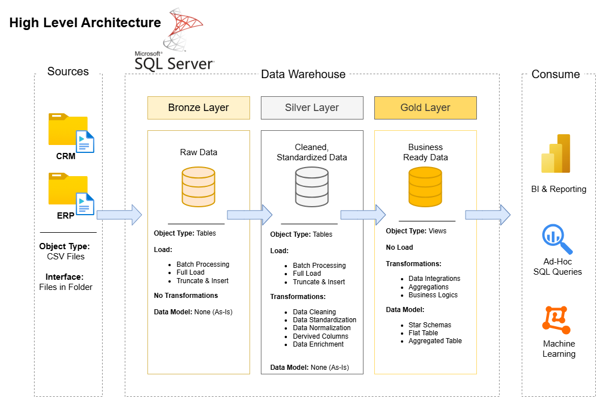

# SQL Data Warehouse and Analytics Project

Welcome to the **SQL Data Warehouse and Analytics Project** repository! 🚀
This project demonstrates how to design and build a **modern data warehouse using SQL Server**, implementing ETL pipelines and preparing business-ready data for analytics.

The project follows industry best practices in **data engineering, data modeling, and analytics** and is designed as a **portfolio project to demonstrate real-world data warehouse development**.

---

# 🏗️ Data Architecture

The project follows the **Medallion Architecture**, consisting of Bronze, Silver, and Gold layers.



### Bronze Layer

* Stores **raw data** from source systems.
* Data is loaded directly from **CSV files** into SQL Server tables.
* No transformations are applied.

### Silver Layer

* Performs **data cleansing and transformation**.
* Standardizes formats and removes inconsistencies.
* Prepares data for analytical modeling.

### Gold Layer

* Contains **analytics-ready datasets**.
* Data is modeled into **Fact and Dimension tables (Star Schema)**.
* Optimized for reporting and BI tools.

---

# 📖 Project Overview

This project demonstrates the complete lifecycle of building a data warehouse:

### Data Architecture

Designing a **modern data warehouse using the Medallion Architecture**.

### ETL Pipelines

Building SQL pipelines to:

* Extract data from source systems
* Transform and clean the data
* Load the data into structured warehouse layers

### Data Modeling

Designing **fact and dimension tables** to support analytical queries.

### Analytics & Reporting

Developing **SQL-based analysis** to generate meaningful insights from the data.

---

# 🎯 Skills Demonstrated

This project showcases expertise in:

* SQL Development
* Data Warehousing
* Data Engineering
* ETL Pipeline Development
* Data Modeling (Star Schema)
* Data Analytics
* Data Architecture

---

# 🛠️ Tools & Technologies

The following tools were used to build this project:

* **SQL Server Express** – Database engine
* **SQL Server Management Studio (SSMS)** – Database management
* **Git & GitHub** – Version control
* **Draw.io** – Architecture and data modeling diagrams
* **CSV Datasets** – Source data

---

# 🚀 Project Requirements

## Building the Data Warehouse (Data Engineering)

### Objective

Develop a **SQL Server data warehouse** to integrate and analyze sales data from multiple systems.

### Specifications

**Data Sources**

Data is imported from two systems:

* ERP system (CSV files)
* CRM system (CSV files)

**Data Quality**

The ETL pipeline handles:

* Missing values
* Standardization
* Data cleansing

**Data Integration**

Data from both sources is integrated into a **single analytical model**.

**Scope**

* Focuses on the **latest dataset**
* Historical tracking is **not included**

**Documentation**

Clear documentation is provided to help both:

* Business users
* Data analysts

---

# 📊 Analytics & Reporting

The Gold Layer enables analytics to answer important business questions such as:

### Customer Behavior

* Who are the top customers?
* What purchasing patterns exist?

### Product Performance

* Which products generate the most revenue?
* Which products perform poorly?

### Sales Trends

* How do sales change over time?
* Which regions generate the highest sales?

These insights help organizations **make data-driven decisions**.

---

# 📂 Repository Structure

```
data-warehouse-project/

│
├── datasets/                         # Raw datasets (ERP & CRM source data)
│
├── docs/                             # Documentation and architecture diagrams
│   ├── etl.drawio
│   ├── data_architecture.drawio
│   ├── data_catalog.md
│   ├── data_flow.drawio
│   ├── data_models.drawio
│   ├── naming_conventions.md
│
├── scripts/                          # SQL scripts for ETL pipelines
│   ├── bronze/                       # Raw data ingestion scripts
│   ├── silver/                       # Data cleaning and transformation
│   ├── gold/                         # Analytical data models
│
├── tests/                            # Data quality tests
│
├── README.md                         # Project documentation
├── LICENSE                           # License file
├── .gitignore                        # Git ignored files
└── requirements.txt                  # Project dependencies
```

---

# 🔄 ETL Pipeline Workflow

The ETL pipeline processes data through three layers:

### Step 1 — Load Bronze Layer

Raw data is loaded from **CSV files into SQL Server tables**.

### Step 2 — Transform to Silver Layer

Data is cleaned, standardized, and prepared for analytics.

### Step 3 — Build Gold Layer

Data is transformed into **Fact and Dimension tables**.

This structure ensures:

* Data consistency
* Improved query performance
* Reliable analytics

---

# 🧪 Data Quality Checks

Quality tests are included to ensure reliable data.

Examples include:

* Duplicate record detection
* Null value validation
* Data consistency checks
* Referential integrity validation

---

# 📚 Documentation

Additional documentation can be found in the **docs** folder:

* Data Architecture Diagram
* Data Flow Diagram
* Data Models (Star Schema)
* Data Catalog
* Naming Conventions

---

# 🛡️ License

This project is licensed under the **MIT License**.
You are free to use, modify, and distribute this project with proper attribution.

---

# 👨‍💻 Author

**Jaynit Dhamanskar**

This project was created as a **portfolio project to demonstrate practical data engineering and SQL data warehousing skills.**

If you found this project helpful or interesting, feel free to ⭐ star the repository.
