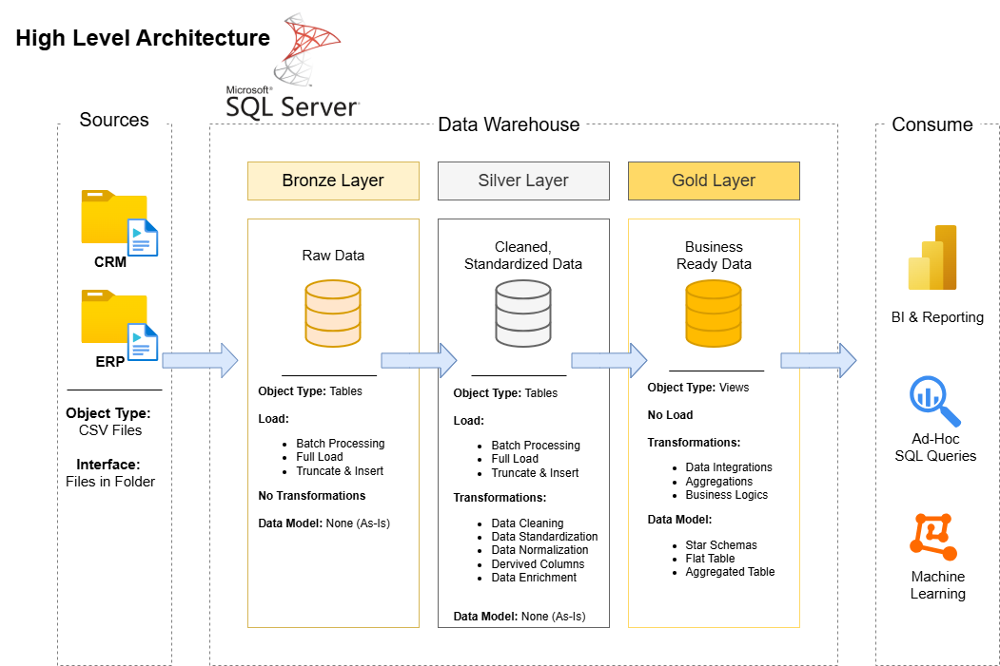

# 📊 Data Warehouse Project

A complete **end-to-end data engineering and analytics project** built using **SQL Server + Power BI**, designed to demonstrate how raw data is transformed into actionable business insights.

This project follows **modern data warehouse principles** and delivers a **fully functional BI dashboard** covering:

* Executive Overview
* Customer Insights
* Product Performance

---

# 🧠 Project Highlights

* 🏗️ Built a **Medallion Architecture (Bronze → Silver → Gold)**
* 🔄 Designed **ETL pipelines using SQL**
* 📊 Created **analytics-ready star schema (Fact & Dimension tables)**
* 📈 Developed **interactive Power BI dashboards**
* 🎯 Delivered insights on **sales, customers, and product performance**

---

# 🏗️ Data Architecture

The project follows the **Medallion Architecture**:



### 🥉 Bronze Layer (Raw)

* Ingests raw data from **ERP & CRM CSV files**
* Stored as-is in SQL Server
* No transformations applied

### 🥈 Silver Layer (Cleaned)

* Data cleaning & standardization
* Handles missing values, duplicates, inconsistencies
* Prepares structured datasets

### 🥇 Gold Layer (Analytics)

* Star schema modeling:

  * Fact tables (Sales)
  * Dimension tables (Customer, Product, Date)
* Optimized for reporting
* Includes **business-ready views**

---

# 📊 BI & Dashboard Layer

Power BI dashboards are built on top of the **Gold Layer**, ensuring:

* High performance
* Reusability
* Consistent business logic

---

## 🖥️ Dashboard Pages

### 1️⃣ Executive Overview

* Total Sales, Orders, Quantity, AOV
* Revenue by Country
* Category Contribution
* Sales Trend Over Time

### 2️⃣ Customer Insights

* Customer Segmentation (New, VIP, Regular)
* Age Group Distribution
* Recency Analysis (Active, At Risk, Inactive)
* Avg Monthly Spend

### 3️⃣ Product Performance

* Top 10 Products by Revenue
* Price Segment Contribution
* Product Performance Quadrant (Sales vs Quantity)

---

# 📂 Repository Structure

```
data-warehouse-project/

│
├── datasets/                         # Raw ERP & CRM data
│
├── docs/                             # Documentation & diagrams
│   ├── architecture.drawio
│   ├── data_flow_diagram.drawio
│   ├── data_models.drawio
│   ├── data_catalog.md
│   ├── naming_conventions.md
│
├── scripts/                          # SQL ETL pipelines
│   ├── bronze/                       # Raw ingestion
│   ├── silver/                       # Cleaning & transformation
│   ├── gold/                         # Star schema & views
│
├── tests/                            # Data quality checks
│
├── dashboard/                        # Power BI files
│   └── sales_customer_insights.pbix
│
└── README.md
```

---

# ⚙️ Tech Stack

| Layer           | Technology                     |
| --------------- | ------------------------------ |
| Data Storage    | SQL Server                     |
| Data Modeling   | Star Schema                    |
| Architecture    | Medallion (Bronze/Silver/Gold) |
| Visualization   | Power BI                       |
| Documentation   | Draw.io                        |
| Version Control | Git & GitHub                   |

---

# 🔄 Data Pipeline Flow

1. Extract raw data from ERP & CRM (CSV)
2. Load into Bronze layer (SQL Server)
3. Transform & clean in Silver layer
4. Model into Fact & Dimension tables (Gold)
5. Create reporting views
6. Connect Power BI to Gold layer
7. Build interactive dashboards

---

# 📈 Key Business Insights Delivered

* 💰 Revenue trends across time and geography
* 🧑‍🤝‍🧑 Customer segmentation & behavior patterns
* 🔁 Customer retention via recency analysis
* 🛍️ Product performance and pricing insights
* 📊 Sales vs Quantity quadrant analysis
